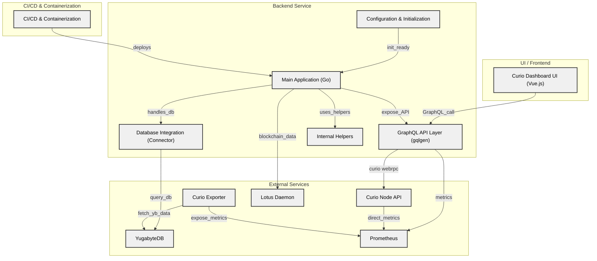

# Curio Dashboard

[](https://github.com/web3tea/curio-dashboard/actions) [](https://goreportcard.com/report/github.com/web3tea/curio-dashboard) [](https://www.codefactor.io/repository/github/web3tea/curio-dashboard) [](https://github.com/web3tea/curio-dashboard/releases)

## Overview

`Curio Dashboard` is a web-based interface designed for monitoring and managing your [Curio](https://github.com/filecoin-project/curio) cluster. It provides an intuitive layout with real-time metrics and rich visualizations, allowing you to efficiently oversee cluster activity and data insights.

|  |  |
|:--------------------------------:|:------------------------------:|
|  |  |
### Key Features

- **Authenticated Access**: Secure login ensures data protection.
- **Efficient Data Management**: Server-side pagination and filtering for handling large datasets.
- **Responsive UI**: Dark/light mode support and mobile-friendly for enhanced usability.
- **Real-Time Monitoring**: Live data streaming for real-time insights.
- **Data Visualizations**: Detailed charts to analyze cluster performance and trends.

## Architecture Diagram


## Requirements

- **Curio Node**: A reachable Curio Web API, e.g., `http://localhost:4701`.
- **YugabyteDB**: Distributed database used by the Curio cluster.
- **Prometheus**: Collects metrics from the Curio cluster for monitoring. (Optional)
- **Lotus Daemon Node**: Required for blockchain data retrieval.

## Usage

### Docker

```bash
# Pull the latest Docker image
docker pull ghcr.io/web3tea/curio-dashboard:latest  # Use the latest release
# docker pull ghcr.io/web3tea/curio-dashboard:main # Use the main branch

# Generate the default configuration file
docker run --rm ghcr.io/web3tea/curio-dashboard:latest config default > config.toml

# Edit the configuration file
# vim config.toml # or use your preferred text editor

# Run the dashboard
docker run -d \
  -p 9091:9091 \
  --restart unless-stopped \
  -v "$(pwd)"/config.toml:/config.toml:ro \
  ghcr.io/web3tea/curio-dashboard:latest --debug run
```

### Pre-built Binaries

Visit the [Releases](https://github.com/web3tea/curio-dashboard/releases) page to download the latest binaries.

After downloading the correct binary for your platform and architecture, follow the [Running the Dashboard](#running-the-dashboard) instructions below.

### Building From Source

Follow these steps to build the dashboard from source:

1. **Install System Dependencies**
   Follow the [Curio Storage Installation Guide](https://docs.curiostorage.org/installation#linux-build-from-source).
   You’ll also need Node.js and Yarn for the frontend.

2. **Clone the Repository**
   ```bash
   git clone https://github.com/web3tea/curio-dashboard.git
   ```

3. **Build the Project**
   ```bash
   cd curio-dashboard
   make
   ```

## Running the Dashboard

1. **Generate Default Configuration**
   ```bash
   ./curio-dashboard config default > config.toml
   ```

2. **Edit the Configuration**
   Adjust the `config.toml` to match your setup, or start with a [minimal configuration file](minimal.config.toml).

3. **Start the Backend**
   ```bash
   ./curio-dashboard --debug run
   ```

4. **Access the Dashboard**
   - Production URL: [http://localhost:9091](http://localhost:9091)
   - Development URL: [http://localhost:3000](http://localhost:3000) (`cd ui; yarn dev`)
